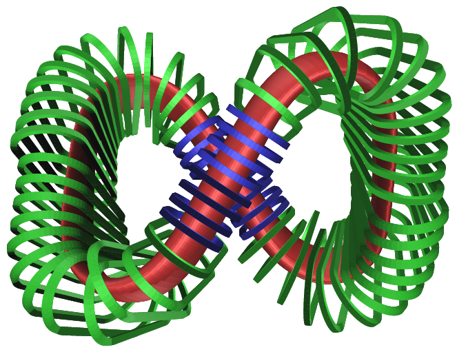

# Summary

The description of the plasma state for non-axisymmetric magnetic confinement fusion devices (stellarators) is a non-trivial task.  It can be modelled by a three-dimensional equilibrium solution of the ideal magnetohydrodynamic (MHD) equations, in which pressure and magnetic field forces are balanced.

The Galerkin Variational Equilibrium Code (GVEC) is a new code for finding 3D MHD equilibrium solutions, given a plasma boundary shape.

A distinct feature of GVEC is a flexible coordinate frame, which can represent complex plasma boundary shapes with simple cross-sections [@Hindenlang_2025]. This allows exploration of a wider variety of plasma states, which might not be representable in the usual cylindrical coordinates.

# Statement of need

MHD equilibrium solutions are the basis for a number of high fidelity plasma physics models and associated codes.
For example, they provide the initial conditions for linear and nonlinear MHD solvers (e.g. CASTOR3D  [@puchmayr2023helical], CAS3D [@nuehrenberg1991], Jorek3D [@nikulsin2022jorek3d], Struphy [@holderied_possanner_wang_2021], M3D-C1 [@jardinTriangularFiniteElement2004]),  or the magnetic field for particle orbit tracing (SIMPLE [@albert_kasilov_kernbichler_2020]) and turbulence simulations (e.g.  BOUT++ [@Shanahan_Bold_Dudson_2024], GENE [@maurer2020gene; @navarro2020global]).

3D MHD equilibria are directly used to analyse potential stellarator configurations in optimisation frameworks, such as SIMSOPT [@Landreman2021] or STELLOPT [@doecode_12551].

GVEC has a flexible coordinate frame, allowing it to represent boundary shapes beyond those possible with the standard cylindrical coordinates used by many equilibrium codes. This has been recently used to optimise the boundary shape of the figure-8 stellarator in [@Plunk_figure_8], shown in \autoref{fig:figure_8_with_coils}.

{ width=50% }

# Features

The approach used in GVEC to find solutions to the 3D MHD equilibrium problem is the same as used in VMEC, proposed by @vmec_83. In this approach, the total MHD energy is minimised using a gradient descent method, under the assumption of nested flux surfaces.
This assumption allows the use of flux-aligned coordinates, which consist of a radial coordinate $\rho$ labelling the flux surfaces, and two periodic coordinates $\vartheta$ and $\zeta$, parametrising each surface.
An example is shown in \autoref{fig:frame}.
The MHD equilibrium is then found by moving the flux surface geometry, while the boundary shape and radial profiles (related to plasma pressure and magnetic field representation, such as the rotational transform) are kept fixed.

![Two examples of stellarator equilibria computed in GVEC, either represented in cylindrical coordinates (left) or in a flexible coordinate frame, following a strongly shaped boundary (right).
The flux-aligned coordinates are indicated, with a radial coordinate $\rho$ and two angular coordinates $\vartheta$ and $\zeta$.
In each planar cross-section $\zeta=\text{const}$, a $(\rho,\vartheta)$ grid (black) is shown, as well as the boundary surface (blue) at $\rho=1$ and the magnetic axis (purple) at $\rho=0$.  \label{fig:frame}](images/flux_aligned.pdf){ width=100% }

In GVEC, the flux surface geometry can be represented in the usual cylindrical coordinates, but also in a flexible coordinate frame, enabling cross-sections to be aligned with the boundary shape, as shown in \autoref{fig:frame}. Details are found in @Hindenlang_2025.

Furthermore, the unknowns of the solution in GVEC are represented using a tensor-product of B-splines in the radial direction and Fourier series in the two angular directions.
A linear constraint ensures that the solution remains smooth across the polar singularity at $\rho=0$.
It is also possible to impose axisymmetry (tokamaks), stellarator-symmetry and discrete rotational symmetry (number of field periods). Both configurations shown in \autoref{fig:frame} have three field periods and are stellarator-symmetric.

GVEC is provided as a python package with core routines written in modern Fortran and parallelised with OpenMP and MPI. The python package allows for simplified installation, execution and post-processing. It can be controlled via the command line or using a python API.

Additional features are:

* possibility to initialise from existing GVEC solutions;
* execution of consecutive runs via "stages", allowing parameter changes, e.g. for refinement, boundary perturbations or optimisation;
* automatic optimisation of the rotational transform profile for targeting a desired toroidal current profile;
* possibility to initialise a stellarator configuration from the QUASR database [@Giuliani_2024_quasr], with an automatically constructed coordinate frame;
* post-processing interfaces to CAS3D, CASTOR3D, GENE, Jorek3D, SIMPLE and Struphy.

# Related software

Various other ideal MHD equilibrium solvers for 3D geometries exist. In the past, VMEC [@vmec_83] has been most commonly used. It uses finite differences radially and Fourier series for the flux surfaces. VMEC has recently been re-implemented in a more modern framework as VMEC++ [@Schilling_2025].
The stellarator optimisation framework DESC [@DESC_2020] is also capable of finding ideal MHD equilibria under the assumption of nested closed flux surfaces, using smooth Zernike-Fourier basis functions for the unknowns.

Other MHD equilibrium solvers exist that do not rely on flux-aligned coordinates, and therefore allow the computation of 3D MHD equilibria with magnetic islands and chaotic regions. SPEC [@hudson_2020] uses the multi-region relaxed MHD model [@holeSteppedPressureProfile2006] and HINT2 [@suzukiDevelopmentApplicationHINT22006] uses a relaxation method. Similarly, the codes SIESTA [@siesta_2011] and PIES [@pies_1986] use iterative techniques to find such 3D MHD equilibria, starting from a VMEC equilibrium solution.

# Acknowledgements

The authors would like to thank the MPCDF team for their services and constant support. We thank the stellarator theory group at IPP in Greifswald for their advice and close collaboration, in particular G. Plunk, C. Nührenberg, A. Goodman, J. Geiger and M. Borchardt. We also like to thank A. Banon Navarro, D. Jarema, M. Maurer, R. Ramasamy, E. Strumberger and J. Puchmayr for their contributions, in particular to the interfaces with other codes.

The authors are also grateful to the contributors to the open source software projects f90wrap [@f90wrap], Xarray [@xarray] and SeLaLib [@selalib], without which this project would not have been possible in this way.

Parts of this work has been carried out within the framework of the EUROfusion Consortium, funded by the European Union via the Euratom Research and Training Programme (Grant Agreement No 101052200 — EUROfusion). Views and opinions expressed are however those of the author(s) only and do not necessarily reflect those of the European Union or the European Commission. Neither the European Union nor the European Commission can be held responsible for them.

# References
